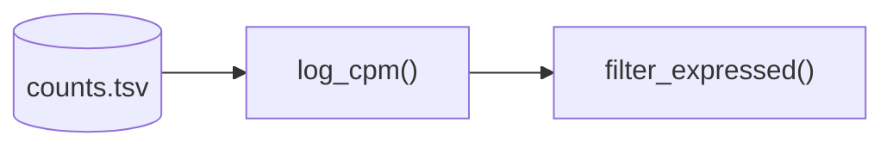

# notate

A local web app for reviewing literature and code and keeping connected Markdown notes. All data is plain files in `workspace/`; there is no database. See [docs/prd.md](docs/prd.md).

## Run

```bash
npm install
npm run dev      # http://127.0.0.1:3000
```

On first run `workspace/` is created from `samples/workspace/`. It is git-ignored, so your notes stay out of the app repo. To keep notes elsewhere (e.g. a separate git repo or synced folder), set `WORKSPACE_DIR=/absolute/path`.

```bash
npm test         # vitest: path safety, frontmatter round-trip, tree, notes
npm run lint
npm run build
```

## Split view

`/split?file=<pdf or code>&note=<note.md>`. Toggle it with the header button or `Ctrl+\`.

- **Left pane:** PDFs render with react-pdf, with selectable text, clickable internal links, zoom, and page jump. Other files open in a line-numbered text view.
- **Right pane:** the note editor.
- **Divider:** drag it, or focus it and use ←/→, Home/End, or Enter to reset. Double-click also resets. The position is remembered per browser.
- **Tree clicks:** while split, notes open on the right and everything else opens on the left.
- **Linked notes:** a note with `source: path/to/file` in its frontmatter opens that file alongside it. "New note for <file>" in an empty note pane sets this for you.
- **Phones:** the panes stack vertically.

The pdf.js worker, fonts, cmaps and wasm are copied from `node_modules` into `public/pdfjs/` by `scripts/copy-pdfjs-assets.mjs`. This runs on install, `dev` and `build`, and the folder is git-ignored.

## Links and tags

- **Link syntax:** `[[target]]`, `[[target|shown text]]` or `[[target#Heading]]`. Type `[[` in the editor for suggestions.
- **Resolution order:** path (relative to the linking note, then from the root) → file name → note title → slugified text. `[[DESeq2 Notes]]` finds `deseq2-notes.md`. Ties prefer the linking note's folder, then the shallowest path.
- **Linking files:** `[[paper.pdf]]` needs the extension. In split view a linked file opens in the left pane and a linked note in the right.
- **Unresolved links** render dashed; click one to create the note.
- **Linked from** at the foot of each note lists every note whose links resolve to it, with the line numbers and lines.
- **Tags:** `#tag` or nested `#bio/rna-seq` inline, plus frontmatter `tags:`. `/tags/bio` includes nested `bio/*` tags. Numbers-only tags like `#42` are ignored.
- **Ignored contexts:** links and tags inside code blocks, inline code, math and URLs don't count. In tables, escape the alias pipe: `[[note\|text]]`.

## Links into code and PDFs

- **Linking:** `[[pipelines/qc.py#L19-L22]]` (or `#L19`) links to lines, and `[[paper.pdf#page=3]]` (or `#p3`) to a page. From a note, the link opens the file in split view beside that note. The code viewer scrolls to and highlights the lines, and the PDF viewer jumps to the page.
- **URLs:** anchors are query parameters, `/split?file=…&note=…&lines=19-22` or `/files/paper.pdf?page=3`, so they work with the back button and bookmarks.
- **Selecting lines:** click a line number in the code viewer, or Shift+click for a range. **Link** / **Code** copy `[[file#L19-L22]]` or the lines themselves. In split view, **Insert link** / **Insert snippet** add the link (and a fenced block numbered from the first line, via `showLineNumbers{19}`) at the note's cursor. The PDF toolbar has the same for the current page.
- **Referenced lines:** lines that notes link to get a green dot in the gutter; hover it to see which notes.

## Citations

**Import citation** (sidebar, dashboard, or the References page) accepts:
- a DOI, like `10.1186/s13059-014-0550-8`
- a PubMed ID (`25516281`, `PMID: 25516281`) or PMC ID (`PMC4302049`)
- an arXiv ID (`arXiv:1706.03762`)
- a link from doi.org, PubMed, PMC, arXiv, bioRxiv/medRxiv, or a publisher page with the DOI in its path

Metadata comes as CSL-JSON:
- **DOIs** via content negotiation at doi.org. That covers Crossref and DataCite, which includes arXiv, Zenodo, and bioRxiv.
- **PubMed and PMC** via NCBI's citation exporter.
- **Redirects** are followed only to those metadata hosts, over HTTPS.

What an import does:
- **Citation key:** suggested in `author + year + first title word` style (`love2014moderated`), unique within the library, and editable before adding.
- **Library file:** the entry is appended as BibTeX to `workspace/references.bib`. Existing entries, hand-written or exported from Zotero, are never rewritten. A work already in the file (same DOI, PMID, or arXiv ID) is detected instead of duplicated.
- **Reading note (optional):** `papers/<key>.md`, from the paper-review template, with `citekey`, authors, year, journal, and DOI in the frontmatter and the abstract when the source provides one.

Citing and browsing:
- **Syntax:** Pandoc-style, `[@key]`, `[@key, p. 3]`, `[see @a; @b]`, or `[-@key]` (year only). Type `[@` in the editor for suggestions.
- **In the preview:** citations render as APA in-text citations that link to the reading note, or to the references page if there's no note. A formatted **References** list closes the note.
- **`/references`:** lists every entry with its identifiers, reading note, the notes citing it, and copy buttons for the key and the BibTeX entry.
- **Removing entries:** edit `references.bib` directly.

## Database identifiers

Accessions in note text link to their database automatically in the preview. The patterns live in `lib/accessions.ts`.

| Kind | Examples |
|---|---|
| Sequencing & expression | `GSE60450`, `SRR1552450`, `ERR000001`, `PRJNA257197`, `SAMN02981297`, `E-MTAB-513`, `phs000178`, `EGAS00001000001` |
| Genes & sequences | `ENSG00000141510`, `NM_000546.6`, `MN908947.3` (versioned GenBank), `GCF_000001405.40`, `Gene ID: 7157`, `HGNC:11998` |
| Proteins & structures | `P04637`, `AF-P04637-F1`, `PDB 1TUP`, `IPR011615`, `PF00870` |
| Variants & clinical | `rs334`, `VCV000015333`, `OMIM:191170`, `NCT04368728`, `CVCL_0030` |
| Ontologies, pathways & chemistry | `GO:0006915`, `HP:`/`MONDO:`/`UBERON:`/`CL:`/`DOID:`/`EFO:` terms, `R-HSA-109581`, `MeSH D003920`, `taxid:9606`, `CHEBI:15377`, `CHEMBL25` |
| Literature | `doi:10.…` or bare DOIs, `PMID: 25516281`, `PMC4302049`, `arXiv:1706.03762` |

How matching works:
- **Precision over recall:** PDB codes, NCBI Gene/Taxonomy numbers, OMIM, MeSH and PubMed IDs need a prefix. That keeps years, gene symbols (BRCA1, CD4) and version numbers from linking.
- **Where IDs don't link:** inside code, math, links, `[[wikilinks]]`, citations and tags.
- **Frontmatter:** values that are identifiers get a link icon. Bare values count too when the field name says what they are (`pmid`, `arxiv`, `pdb`, `taxid`, `gene_id`).
- **`/identifiers`:** lists every ID across notes, grouped by kind, with the notes that mention it.

## Queries

**Query** (sidebar, `/query?q=…`) finds notes by frontmatter and by what they contain. A `query` fence in a note renders the same results as a live table, which updates as notes change:

````markdown
```query title="Reading list"
type:paper-review tag:scrna-seq -has:dataset year:>=2020 sort:-year show:authors,year,doi
```
````

| Syntax | Matches |
|---|---|
| `type:paper-review` | Field equals the value, ignoring case. For lists (`authors`), any item. |
| `type:experiment,theorem` | Any of the values |
| `title:~deseq`, `status:run*` | Contains; wildcard |
| `year:>=2020`, `year:2019..2023` | Comparison (`>` `>=` `<` `<=`) or inclusive range. Numbers compare as numbers; other values as text by prefix, so `date:<=2026-09` includes all of September. |
| `has:doi`, `-has:dataset`, `doi:*` | Field set / missing. Empty strings and lists count as missing. |
| `meta.version`, `authors.0` | Nested key or list item |
| `journal:"Genome Biology"` | Quoted value with spaces |
| `tag:bio`, `#bio` | Frontmatter or inline tag, including nested `bio/…` |
| `in:papers` | Notes in a folder |
| `cites:love2014moderated` | Notes citing a key |
| `mentions:GSE60450`, `mentions:GSE*` | Notes mentioning a database ID |
| `links:deseq2-love-2014`, `links:pipelines/qc.py` | Notes linking to a note or file, resolved like `[[links]]` |
| `modified:>=2026-09-01` | Last modified date |
| `-term` | Excludes matches of any term |
| `deseq` | Title or path contains the word |
| `sort:-year,title`, `limit:20`, `show:year,doi` | Order (`-` for descending; default newest first), row count, and columns |

- **Combining:** terms combine with AND. A comma inside one value means OR.
- **Columns:** without `show:`, the table shows the fields the query filters and sorts on. Values that name a workspace file, a DOI, or another identifier become links.
- **Query page:** lists every frontmatter field with how many notes set it. Click a column header to sort. **Copy CSV** exports the results, and **Copy as note block** gives you a fence to paste.
- **Mistakes:** an unknown directive value such as `limit:abc` is reported above the table rather than failing the query.

## Diagrams and callouts

**Diagrams:** a ```mermaid fence is drawn with [Mermaid](https://mermaid.js.org) — flowcharts for pipeline DAGs, plus sequence, state, class, ER, Gantt, pie and git graphs. `title="…"` names the diagram in its header. The library loads on first use and keeps the source out of the way, so **Copy** on the header gives you the diagram text back.

````markdown

````

A diagram that doesn't parse shows the error and the source instead of breaking the note.

**Callouts:** start a blockquote with `[!type]`, GitHub-style, followed by an optional title.

```markdown
> [!theorem] Gamma–Poisson mixture
> If $\Lambda \sim \mathrm{Gamma}(r, \theta)$ and $K \mid \Lambda \sim \mathrm{Poisson}(\Lambda)$, then $K$ is negative binomial.

> [!warning] Raw counts only
> DESeq2 models raw counts.
```

| Kind | Types |
|---|---|
| Statements (numbered, set in italics) | `theorem`, `lemma`, `proposition` (`claim`), `corollary`, `conjecture` |
| Other environments | `definition` and `example` (numbered), `proof` (ends with ∎), `remark` |
| Admonitions | `note` (`info`), `tip`, `important`, `warning`, `caution` (`danger`), `question`, `todo`, `abstract` (`summary`), `quote`, `bug` |

- **Numbering** counts each type separately within the note, so you get Theorem 1, Theorem 2, Lemma 1. Titles show in brackets after the number, as in a paper.
- **Collapsing:** `[!note]-` starts collapsed, `[!note]+` starts open and can be clicked shut.
- **Inside a callout** everything else still works: maths, code blocks, links, tags and nested callouts.
- **Unknown types** stay ordinary blockquotes, so notes written elsewhere aren't mangled.

## Code blocks

Fenced code in notes is highlighted with Shiki (`github-dark-default`) and gets a header with the language or title and a **Copy** button.

````markdown
```python title="qc.py" showLineNumbers {2}
counts = load_counts()
keep = counts.sum(axis=1) >= 10
counts = counts[keep]  # [!code ++]
counts = counts.dropna()  # [!code --]
```
````

- **Fence options:** `title="…"`, `showLineNumbers` and `{1,3-5}` (highlight lines).
- **Inline markers:** `// [!code highlight]`, `// [!code ++]` and `// [!code --]`, written with the language's own comment syntax.
- **Copy:** leaves out `--` lines, so you get the "after" version.
- **Languages:** Python, R, Julia, MATLAB, shell, SQL, Nextflow, YAML/JSON/TOML/XML/CSV, LaTeX, JS/TS, C/C++, Rust, Go, Java, Fortran, Docker, Make, CMake, diff and more. `snakemake`, `rscript` and `console` map to the nearest grammar; unknown languages render as plain text.
- **Code viewer:** the same highlighter colours files up to 8,000 lines. Larger files stay plain so the tab doesn't freeze.
- **Loading:** grammars load on first use, as separate chunks.

## API

| Route | Description |
|---|---|
| `GET /api/fs/tree` | Nested JSON tree of the workspace (`name, path, type, ext, mtime, size, children`) |
| `GET /api/notes?limit=20` | Recently modified notes with title, type, tags |
| `GET /api/index` | All notes (title, type, tags), linkable files, tag counts and frontmatter field counts. Parsed notes are cached by mtime |
| `GET /api/query?q=…` | `{ columns, rows: [{ path, title, values }], total, errors }` for a query. At most 500 rows |
| `POST /api/citations/lookup` | `{ query }` → metadata, suggested key, and `existingKey` if already in the library |
| `GET /api/references` | Entries in `references.bib` with APA text, in-text form and BibTeX. `error` if the file can't be parsed |
| `POST /api/references` | `{ query, key }`. Re-fetches the metadata (cached briefly) and appends to `references.bib`. `409` for a duplicate work or key |
| `GET /api/backlinks/[...slug]` | Notes linking to a note or file, with `{ line, context }` for each mention |
| `GET /api/notes/[...slug]` | `{ path, frontmatter, content, mtime }` for a `.md` file |
| `POST /api/notes/[...slug]` | JSON `{ frontmatter?, content, createOnly? }`; atomic write; `409` if `createOnly` and the file exists |
| `GET /api/files/raw/[...slug]` | UTF-8 text for code/data files, `application/pdf` for PDFs; `415` for other binaries, `413` over 50 MB |

### Safety
The routes read and write real files, so:
- Paths are confined to the workspace: `..`, encoded slashes, dotfiles, Windows device names/ADS, and symlinks escaping the root are rejected.
- The dev server binds to `127.0.0.1`, and the API rejects non-localhost `Host` headers (DNS rebinding) and cross-origin `Origin`s (other browser tabs). Set `NOTATE_ALLOW_REMOTE=1` to disable the check.
- Notes render without raw HTML, and raw files are served with `nosniff`.
- YAML frontmatter uses the core schema, so `date: 2026-09-15` stays a string and is not rewritten as a timestamp on save.

## Layout

```
app/api/…            route handlers (thin; logic lives in lib/)
app/page.tsx         dashboard: recently edited notes
app/notes/[...slug]  note editor: frontmatter card, Write/Preview, 1 s autosave
app/files/[...slug]  full-width PDF / code view for a single file
app/split            dual-pane view (file left, note right)
components/          app shell, file tree, editor, KaTeX/GFM preview, callouts, diagrams, queries, dialogs, split panes
components/viewers/  react-pdf viewer, code viewer
lib/                 workspace path guard, tree, notes, frontmatter, templates
samples/workspace/   seed notes copied on first run
```
